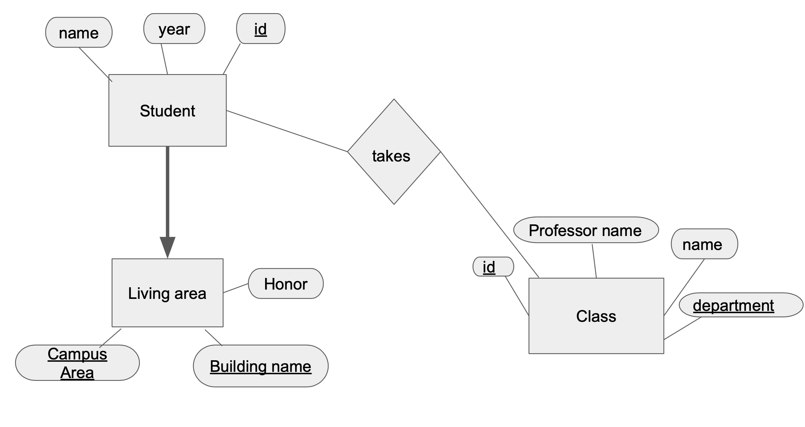

## What this is about
I took CS 345, which is about Database Management, and the class did not teach us much about how to connect the database with Python or other major languages. 
I wanted to learn how to create and manipulate SQL databases with Python through this personal project.

## How to access to the [mySQL panel](https://stackoverflow.com/questions/35858052/how-to-fix-command-not-found-mysql-in-zsh)
- Export the path every time you open the terminal
    - export PATH=${PATH}:/usr/local/mysql/bin/
- connect to the MySQL (rule of thumb is "mysql -u {yourUserName} -p")
    - In this our case, yourUserName is 'root'
    - mysql -u root -p
- Display all databases by putting "SHOW DATABASES;"
- [Switch](https://linuxize.com/post/show-tables-in-mysql-database/) to the desired database using "USE {the name of the database}"
- Display all table information by doing "SHOW TABLES;"

## Important downloads
1. [mySQL Community Server](https://dev.mysql.com/downloads/mysql/)
    - must be downloaded first to connect the mySQL server 
2. [mySQL Workbench](https://www.mysql.com/products/workbench/)
    - must be downloaded to manage database connection


## Library
- mysql-connector-python

Remember to install the package with the following command
```
pip install <the name of the package>
```

## Entity Relation Diagram



## Important functions
- sql.connector.connect(host, user_name, user_password)
- sql.connector.cursor()
- sql.connector.cursor().execute(query)
- [sql.connector.commit()](https://dev.mysql.com/doc/connector-python/en/connector-python-api-mysqlconnection-commit.html)
    - to commit the current transaction, by default Python does not autocommit (commiting is one of the way for isolation level)
- [cursor.fetchall()](https://dev.mysql.com/doc/connector-python/en/connector-python-api-mysqlcursor-fetchall.html)
    - fetches all (or all remaining rows) of a query result set and result a list of tuples. If no more rows are available, it returns an empty list.

## Resources
- [freeCodeCamp](https://www.freecodecamp.org/news/connect-python-with-sql/)